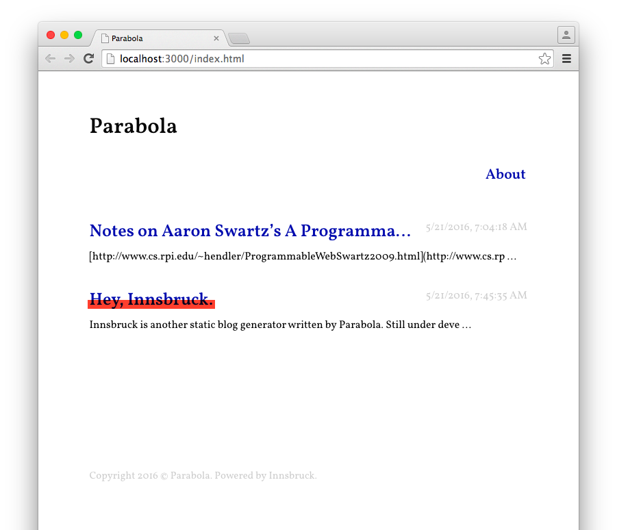

# innsbruck

A minimal, static, content focused and super light weighted blogging tool. For humans.

## usage (for developers)

0. Make sure you have:
    1. Node.js >= 5.0.0 (use `$ node -v` to print the version (you can use the library `n` to switch Node.js version))
    2. NPM
1. Clone this repo into your `username.github.io` repo (GitHub Pages)
2. Cd into the repo path: `$ cd username.github.io`
3. Install dependencies: `$ npm install`
4. Start: `$ npm start` and you will see the server running on port 3000
5. ~~Open http://localhost:3000 in your browser~~
6. Manage your site / write posts, any change will trigger the static site building automatically (yeah, in this root directory)
7. Git push

Terminal arguments:
- Custom port number: `$ node index.js --port=2000`
- Do not start up in the browser automatically: `$ node index.js -s`

## usage (binary application)

TODO.

## changelog

TODO.

## demo

http://quietshu.github.io/

## plugins

See /plugin/google-fonts.js.

## other

- Accessibility
- Custom CSS
- Google Analytics
- Disqus
- ~~Supports `<noscript>` tag~~
- Plugin System

## acknowledgements

- by Shu Ding
- koa, ejs, lowdb, marked
- MIT licensed

<3, bye!
